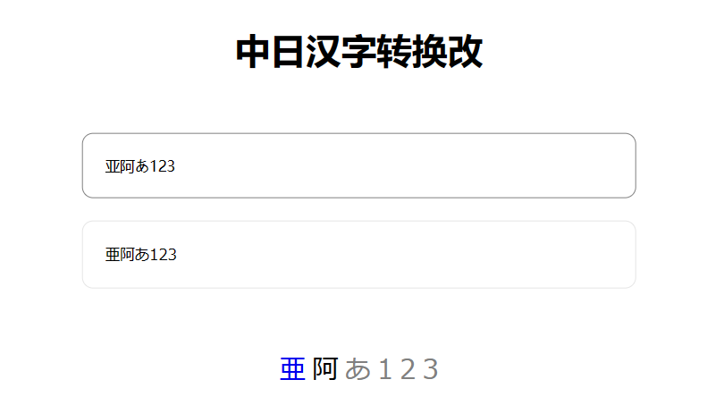
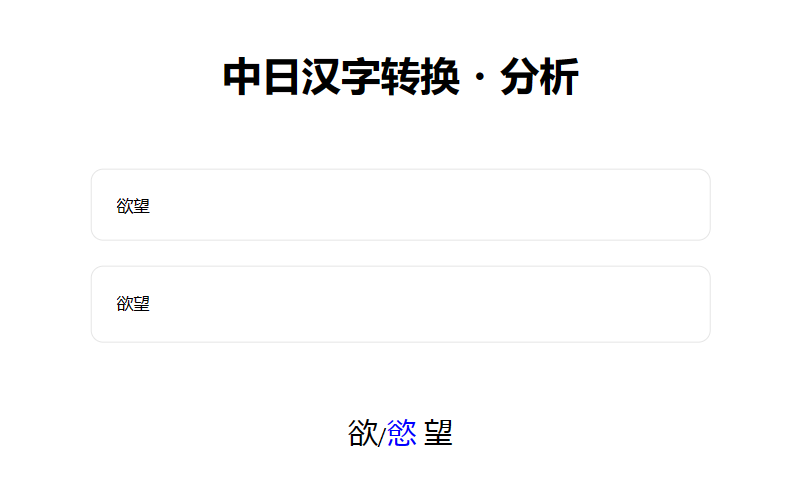

# 中日汉字转换器改

本仓库forked自[https://github.com/manakanemu/ctoj](https://github.com/manakanemu/ctoj)。

原转换器年久失修，且支持的汉字覆盖太少。

**本网站针对shift-jis第一梯队的所有日文汉字进行了逐一排查，整理出了一份基本覆盖日常需要的中日汉字转换表。**

## 网站介绍

本网站可以把中文汉字转化为对应的日文汉字
例如：``爱 - 愛``、``门 - 門``、``真中合欢 - 真中合歓``
这是将汉语汉字转化为日语汉字，而不是繁体汉字，例如 ``亚``的繁体为 ``亞``，而日语中使用的是古体 ``亜`` ,本网站会将汉字转换为后者。

## 使用方法

打开[转换网页](https://kanji.rdfzftxx.xyz/)，在“请输入中文”文本框内输入或粘贴中文，对应的日文会实时翻译在下面的文本框内。

文本框下方的空白区域会出现转换后的汉字列表，点击对应汉字后会跳转到[Sljfaq.Org漢字字典](https://kanji.sljfaq.org/k/)的对应汉字页面。

#### 文字类型

转换后的文字在汉字列表中会显示三种颜色：`蓝色 / 黑色 / 灰色`

 

`蓝色` ：成功在shift-jis第一梯队中找到了对应的日文汉字并翻译。

`黑色` ：该汉字已经存在于shift-jis第一梯队中，无需翻译。

`灰色` ：shift-jis第一梯队中没有找到对应的汉字。输入可能不是汉字，或是无法识别的汉字。

#### 复数对应

当出现中文汉字对应多个日语汉字时，下方的汉字列表会出现复数对应的汉字。

复数对应的汉字以 `/` 分隔。此时的汉字仍然遵循文字类型的标色。

文字框中以第一位的汉字进行显示。如有需要请自行进行替换。
